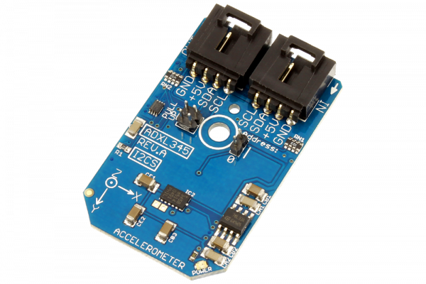

#ADXL345

Manufactured by Analog Devices, the ADXL345, is a low-power 3-axis accelerometer with high-resolution 13-bit measurement at up to ±16g.It measures the static acceleration of gravity in tilt-sensing applications, as well as dynamic acceleration resulting from motion or shock.
This Device is available from www.ncd.io 

[SKU: ADXL345_I2CS]

(https://store.ncd.io/product/adxl345-3-axis-accelerometer-13-bit-i2c-mini-module/)
This Sample code can be used with Arduino.

Hardware needed to interface ADXL345 accelometer with Arduino

1. <a href="https://store.ncd.io/product/i2c-shield-for-arduino-nano/">Arduino Nano</a>

2. <a href="https://store.ncd.io/product/i2c-shield-for-arduino-micro-with-i2c-expansion-port/">Arduino Micro</a>

3. <a href="https://store.ncd.io/product/i2c-shield-for-arduino-uno/">Arduino uno</a>

4. <a href="https://store.ncd.io/product/dual-i2c-shield-for-arduino-due-with-modular-communications-interface/">Arduino Due</a>

5. <a href="https://store.ncd.io/product/adxl345-3-axis-accelerometer-13-bit-i2c-mini-module/">ADXL345 3 axis accelometer</a>

6. <a href="https://store.ncd.io/product/i%C2%B2c-cable/">I2C Cable</a>

ADXL345:

Manufactured by Analog Devices, the ADXL345, is a low-power 3-axis accelerometer with high-resolution 13-bit measurement at up to ±16g.It measures the static acceleration of gravity in tilt-sensing applications, as well as dynamic acceleration resulting from motion or shock.

Applications:

•Medical instrumentation

•Handsets

•Gaming and pointing devices

•Hard disk drive (HDD) protection 

•Industrial instrumentation

How to Use the ADXL345 Arduino Library
The ADXL345 has a number of settings, which can be configured based on user requirements.

1.Data rate selection:The following command selects the data rate for the accelometer as 3200Hz.

       adxl.setAccelDataRate(ADXL345_DATARATE_3200HZ);         // Bandwidth: 3200Hz
       
2.Output range of accelometer:The following command selects the maximum output range for the accelometer as ±16g.

        adxl.setAccelRange(ADXL345_RANGE_16G);                  // ±16g
        
